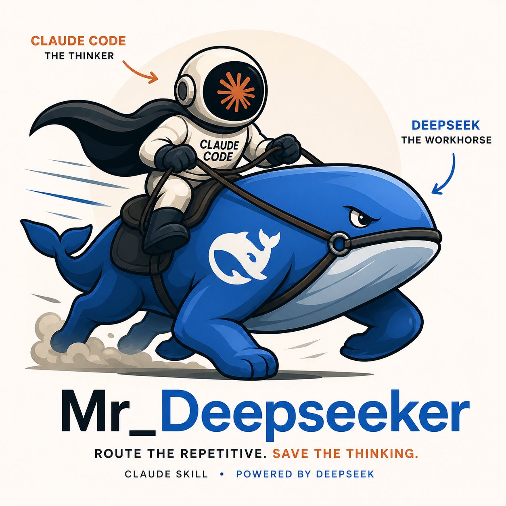

# Mr_Deepseeker

<p align="center">
  
</p>

> *"Why pay a surgeon to mop the floor?"*

**Mr_Deepseeker is a Claude Code skill** that intercepts mechanical code tasks — reviews, test generation, boilerplate, docstrings, translation — and routes them to DeepSeek instead of burning your Claude session budget on them.

You keep working in Claude Code exactly as you do now. Mr_Deepseeker just makes sure the expensive model only does the expensive work.

Zero dependencies. Pure Python stdlib.

---

## Install

**Easiest: let your AI agent do it.** Works with Claude Code, Codex, and similar agents. Open a session and say:

```
Fetch https://raw.githubusercontent.com/harry0537/Mr_Deepseeker/main/SETUP_PROMPT.md with curl -fsSL and follow it exactly.
```

The agent clones the repo, creates `.env` for you to put your key in (you never paste the key into chat), wires up the skill (Claude Code) or adds instruction notes (other agents), and runs a smoke test. See [SETUP_PROMPT.md](SETUP_PROMPT.md).

**Option A: manual**

```bash
git clone https://github.com/harry0537/Mr_Deepseeker.git ~/.claude/skills/Mr_Deepseeker
cd ~/.claude/skills/Mr_Deepseeker && cp .env.example .env && chmod 600 .env
```

Open `~/.claude/skills/Mr_Deepseeker/.env` and replace `paste-your-key-here` with your key ([platform.deepseek.com](https://platform.deepseek.com/api_keys)). Restart Claude Code.

**Option B: installer**

```bash
curl -fsSL https://raw.githubusercontent.com/harry0537/Mr_Deepseeker/main/install.sh | bash
```

Clones (or updates) the skill and creates `.env` for you to edit. Your key never goes through the terminal or chat. Restart Claude Code.

---

## What happens inside Claude Code

Ask Claude to do any mechanical code task and Mr_Deepseeker handles it:

```
you:    review my project
claude: [runs DeepSeek review, presents results — zero session tokens burned]

you:    write tests for src/parser.py
claude: [generates full pytest suite via DeepSeek]

you:    expand this stub
claude: [fills out implementation via DeepSeek]

you:    translate utils.py to TypeScript
claude: [routes to DeepSeek, returns idiomatic TS]
```

Trigger phrases: *"review [project]"*, *"audit [folder]"*, *"find bugs in"*, *"write tests for"*, *"generate boilerplate"*, *"write docstrings"*, *"expand this stub"*, *"translate to [language]"*, *"refactor this"*, *"add type hints"*, *"fix these bugs"*, *"what does this file do"*, *"generate commit message"*

---

## The economics

Same $1. Completely different output.

| $1 spent on… | Code reviews | Test files written | Files summarized |
|---|---|---|---|
| **Claude Sonnet** | ~18 | ~12 | ~55 |
| **Mr_Deepseeker** | ~250 | ~165 | ~750 |
| **Multiplier** | **14×** | **14×** | **14×** |

DeepSeek runs the same class of task at roughly **1/14th the cost** of Claude Sonnet. That multiplier holds across review, generation, and summarization — anything token-heavy and mechanical.

**What this means in practice:** every time you ask Claude to review a file, write a test, or summarize a module, you're spending 14× more than you need to. Mr_Deepseeker intercepts those tasks and routes them to DeepSeek. Your Claude budget stays intact for the work only Claude can do — architecture decisions, debugging reasoning, planning.

**Mr_Deepseeker is not a replacement for Claude. It's the system that makes Claude last.**

---

## What it can do

### Code Review
Severity-ranked bug reports with file/line references and remediation hints:

```
[CRITICAL] order_manager.py:87  [race_condition]
    Position update and order submission are not atomic
    FIX: Use asyncio.Lock() around the update block

[HIGH]     risk_engine.py:134  [logic_error]
    Kelly fraction not clamped — can return >1.0 on high-confidence signals
    FIX: fraction = min(kelly_fraction, max_kelly) before returning
```

### Boilerplate & Generation
- **generate** — code from a plain-English description
- **expand_stub** — fill out a skeleton or TODO implementation
- **write_tests** — full pytest suite for any module
- **write_docstrings** — add docstrings to every undocumented function
- **translate** — rewrite code in another language (Go, TypeScript, Rust, etc.)

---

## Using the Python API directly

The skill runs on top of a clean Python library you can also call standalone:

```python
from mr_deepseeker import review_project, review_all, generate, write_tests, load_env
load_env()

# Review a project
result = review_project("/path/to/project", context="focus on race conditions")
for bug in result["bugs"]:
    print(f"[{bug['severity'].upper()}] {bug['file']}:{bug.get('line','')} — {bug['description']}")

# Review multiple projects in parallel
report = review_all({
    "api":    {"path": "/path/api",    "context": "REST API"},
    "worker": {"path": "/path/worker", "context": "async worker"},
})

# Generate boilerplate
code = generate("async rate limiter using token bucket, stdlib only")
tests = write_tests(open("src/parser.py").read())
```

### CLI

```bash
python3 scripts/review.py review /path/to/project
python3 scripts/review.py review /path/to/project "focus on async race conditions"
python3 scripts/review.py review-all examples/custom_registry.json
python3 scripts/review.py json /path/to/project
```

---

## LLM fallback chain

One key is enough. Tries providers in order until one succeeds:

1. **DeepSeek** (`DEEPSEEK_API_KEY`) — primary, best for code, cheapest
2. **OpenRouter** (`OPENROUTER_API_KEY`) — `deepseek/deepseek-chat`, same model
3. **OpenAI** (`OPENAI_API_KEY`) — `gpt-4o-mini`
4. **OpenRouter free models** — qwen3-coder / llama-3.3-70b / nemotron
5. **Groq** (`GROQ_API_KEY`) — fast free tier, rate limited

Fall-through is silent: a revoked DeepSeek key lands you on an 8B model with no
error. `last_engine()` reports which provider actually answered — see
[references/contract.md](references/contract.md).

---

## Project structure

```
SKILL.md                ← the Claude Code skill (repo root = skill folder)
SETUP_PROMPT.md         ← hand to your AI agent for guided setup
references/             ← output contract, trading brain notes

mr_deepseeker/          ← the engine underneath
├── deepseek.py         # review_project(), review_all()
├── boilerplate.py      # generate(), expand_stub(), write_tests(), write_docstrings(), translate()
├── llm_client.py       # LLM delegation + fallback chain
└── env.py              # .env loader

scripts/
└── review.py           # standalone CLI

examples/
└── custom_registry.json
```

---

## License

MIT
